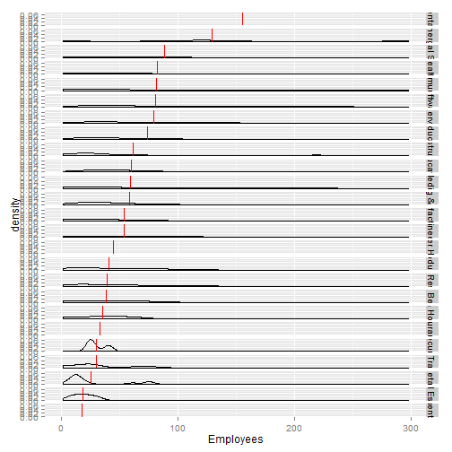
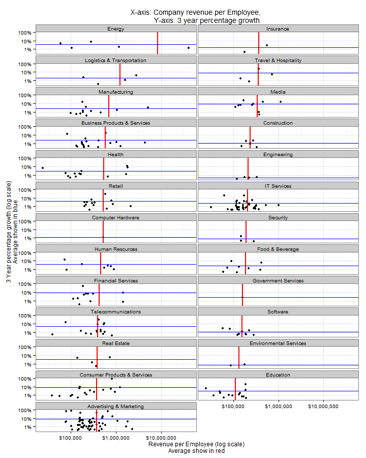

Principles of Data Visualization & Intro to ggplot2
========================================================

## Assignment Instructions / Background

I have provided you with data about the 5,000 fastest growing companies in the US, as 
compiled by Inc. magazine. Please use the data available at:
https://github.com/jlaurito/CUNY_IS608/tree/master/lecture1/data

* This assignment must be done in a single R script with ggplot2. Use of plyr is 
encouraged but not required.  
* Images for question ‘x’ must be saved to the lecture1 directory as ‘FigureX.jpg’ or 
‘FigureX.png’ (ie for Question 1, Figure1.jpg, etc).  

## Questions 

1. Create a graph that shows the distribution of companies in the dataset by State (ie 
how many are in each state). There are a lot of States, so consider which axis you 
should use assuming I am using a ‘portrait’ oriented screen (ie taller than wide). 

```r
library(plyr)
library(ggplot2)
library(scales)
library(grid)
```


```r
data <- "../Data/"
figures <- "../Figures/"

# Make sure I'm in the right directory
if (file.exists("Code")) {
    setwd("Code")
}
if (!file.exists("../Data")) {
    stop("Not in the correct working directory!")
}
```


```r
file <- "inc5000_data.csv"
raw.data <- read.csv(paste(data, file, sep = ""), header = TRUE, sep = ",", 
    strip.white = TRUE)
```


```r
by.state <- ddply(raw.data, .(State), summarize, count = length(Rank))
by.state <- by.state[order(by.state$count), ]
by.state$State <- factor(by.state$State, levels = by.state$State)  #This controls ggplot ordering
```


```r
figure1 <- ggplot(data = by.state, aes(x = State, y = count)) + geom_bar(stat = "identity") + 
    coord_flip() + ggtitle("Number of Fastest Growing Tech Companies per State") + 
    theme(axis.title.x = element_blank())
figure1
```

 

```r
# ggsave(figure1, file=paste(figures, 'figure1.png', sep=''), height=10,
# width=8, dpi=100, scale=0.75)
```


2. Let’s dig in on the State with the 3 rd  most companies in the data set. Imagine you 
work for the state and are interested in how many people are employed by 
companies in different industries employ. Create a plot of average employment by 
industry for companies in this state (only use cases with full data (user R’s 
complete.cases() function). Your graph should show how variable the ranges are, 
and exclude outliers. 


```r
# Choose an outlier limit that minimizes the number of companies left out,
# but is allows for important details to be shown
outlier = 300

# Filter on NY, discard companies greater than outlier limit
ny <- raw.data[raw.data$State == "NY" & raw.data$Employees < outlier, ]

# Make sure to note how many companies are being discarded
print("Number of companies discarded")
```

```
## [1] "Number of companies discarded"
```

```r
nrow(raw.data[raw.data$State == "NY" & raw.data$Employees >= outlier, ])
```

```
## [1] 32
```

```r
table(raw.data$Industry[raw.data$State == "NY" & raw.data$Employees >= outlier])
```

```
## 
##      Advertising & Marketing Business Products & Services 
##                            0                            7 
##            Computer Hardware                 Construction 
##                            0                            0 
## Consumer Products & Services                    Education 
##                            1                            0 
##                       Energy                  Engineering 
##                            0                            0 
##       Environmental Services           Financial Services 
##                            0                            2 
##              Food & Beverage          Government Services 
##                            1                            0 
##                       Health              Human Resources 
##                            0                            4 
##                    Insurance                  IT Services 
##                            0                            7 
##   Logistics & Transportation                Manufacturing 
##                            0                            1 
##                        Media                  Real Estate 
##                            1                            0 
##                       Retail                     Security 
##                            0                            1 
##                     Software           Telecommunications 
##                            3                            1 
##         Travel & Hospitality 
##                            3
```

```r

# Summarize average and total number of Employees by Industry
ny.ind <- ddply(ny, .(Industry), summarize, avg.employeed = mean(Employees), 
    total.employed = sum(Employees), num.companies = length(Employees), avg.revenue = mean(Revenue/Employees), 
    sd.revenue = sd(Revenue/Employees), avg.growth = mean(Growth_Rate))
# Order data based on average number of employees (descending)
ny.ind <- ny.ind[order(ny.ind$avg.employeed, decreasing = TRUE), ]

# Order factor levels in main data frame based on average number of
# employees
ny$Industry <- factor(ny$Industry, levels = ny.ind$Industry)
```


```r

# Create box plot
ggplot(ny, aes(x = Industry, y = Employees)) + geom_boxplot() + stat_summary(fun.y = mean, 
    geom = "point", shape = 19, size = 3, color = "red") + coord_flip()
```

 

Remarks on boxplot. Not bad. Good information density, but I'm not a huge fan. I feel like the information is not displayed in a very intuitive way.


```r
ggplot(ny, aes(x = Employees)) + geom_density() + facet_grid(Industry ~ .) + 
    geom_vline(data = ny.ind, aes(xintercept = avg.employeed), color = "red")
```

 

Hard to see much differenciation.


```r
ggplot(ny, aes(x = Employees)) + geom_density() + facet_wrap(~Industry, ncol = 2) + 
    geom_vline(data = ny.ind, aes(xintercept = avg.employeed), color = "red")
```

 

The shortened axis makes the distributions a little easier to see. Still most things are really flat. Also, density is not a very intuitive quantity.


```r
ggplot(ny, aes(x = Employees)) + geom_histogram(binwidth = 2) + facet_wrap(~Industry, 
    ncol = 2) + geom_vline(data = ny.ind, aes(xintercept = avg.employeed), color = "red")
```

 


```r
ggplot(ny, aes(x = Industry, y = Employees)) + geom_violin() + coord_flip()
```

 


Found cool function: http://stackoverflow.com/questions/13297155/add-floating-axis-labels-in-facet-wrap-plot
Adds labels to second row

```r
facetAdjust <- function(x, pos = c("up", "down"))
{
  pos <- match.arg(pos)
  p <- ggplot_build(x)
  gtable <- ggplot_gtable(p); #dev.off()
  dims <- apply(p$panel$layout[2:3], 2, max)
  nrow <- dims[1]
  ncol <- dims[2]
  panels <- sum(grepl("panel", names(gtable$grobs)))
  space <- ncol * nrow
  n <- space - panels
  if(panels != space){
    idx <- (space - ncol - n + 1):(space - ncol)
    gtable$grobs[paste0("axis_b",idx)] <- list(gtable$grobs[[paste0("axis_b",panels)]])
    if(pos == "down"){
      rows <- grep(paste0("axis_b\\-[", idx[1], "-", idx[n], "]"), 
                   gtable$layout$name)
      lastAxis <- grep(paste0("axis_b\\-", panels), gtable$layout$name)
      gtable$layout[rows, c("t","b")] <- gtable$layout[lastAxis, c("t")]
    }
  }
  class(gtable) <- c("facetAdjust", "gtable", "ggplot"); gtable
}

print.facetAdjust <- function(x, newpage = is.null(vp), vp = NULL) {
  if(newpage)
    grid.newpage()
  if(is.null(vp)){
    grid.draw(x)
  } else {
    if (is.character(vp)) 
      seekViewport(vp)
    else pushViewport(vp)
    grid.draw(x)
    upViewport()
  }
  invisible(x)
}
```


When facet_wrap populates a grid, it does it row wise.  
This function orders factors such that a rxc grid will be ordered column wise.  

i.e.:  
Assuming a factor is ordered by rank [1, 2, 3, 4, 5, 6].  
Default behavior with ncol=2 will produce  
1 2  
3 4  
5 6  

This function will order the factors such that facet_wrap with ncol=2 will produce
1 4  
2 5  
3 6  

It does this by ordering the factors as [1, 4, 2, 5, 3, 6]

```r
facet.order <- function(level.order, ncols) {
    ntotal <- length(level.order)
    nrows <- ceiling(ntotal/ncols)
    new.order <- level.order
    for (c in 1:ncols) {
        index.start <- 1 + (c - 1) * nrows
        index.end <- nrows + (c - 1) * nrows
        index.end <- min(index.end, ntotal)
        new.order[seq(from = c, to = ntotal, by = ncols)] <- level.order[index.start:index.end]
    }
    return(new.order)
}
```


See http://stackoverflow.com/questions/3472980/ggplot-how-to-change-facet-labels for adding a function to change facet labels. Would like to use thie to add total number of employees to facet label.


```r
# Dotplot Order summary data based on average number of employees
# (descending)
ny.ind <- ny.ind[order(ny.ind$avg.employeed, decreasing = TRUE), ]

# Order factors for plot
ny$Industry <- factor(ny$Industry, levels = facet.order(ny.ind$Industry, 2))

d <- ggplot(ny, aes(x = Employees)) + theme_bw() + theme(strip.text.x = element_text(size = 8)) + 
    geom_dotplot(binwidth = 5, dotsize = 0.75, method = "histodot") + facet_wrap(~Industry, 
    ncol = 2) + geom_vline(data = ny.ind, aes(xintercept = avg.employeed), color = "red", 
    size = 1) + scale_y_continuous(name = "Each point represents one company", 
    breaks = NULL) + scale_x_continuous(name = "Number of employees (average per industry in red)", 
    breaks = seq(from = 0, to = 300, by = 50), minor_breaks = seq(from = 0, 
        to = 300, by = 10)) + ggtitle("Number of employees per company")

figure2 <- facetAdjust(d)
print(figure2)
```

 

```r
# ggsave('name.pdf', p)
ggsave(figure2, file = paste(figures, "figure2.png", sep = ""), height = 12.5, 
    width = 11, dpi = 100, scale = 0.75)
```

Figure 2. I feel like this give the investor a lot of useful information, without obscuring the average per industry figure. Compare Environmental Services. In the box plot there's no indication that the average is based on 2 companies, and that thery are very far apart. Also, I put these into two columns because I felt that one column was just too spread out, but I set the order of my factors so that the facets would fill "columnwise" so that there's only one difficult comparison to make between Manufacturing and Engineering.

3. Now imagine you work for an investor and want to see which industries generate the 
most revenue per employee. Create a chart makes this information clear.


```r
plot(ny$Revenue/ny$Employees)
```

 

```r
plot(ny.ind$avg.revenue ~ ny.ind$Industry)
```

 


```r
# Order summary data by avg revenue / employee
ny.ind <- ny.ind[order(ny.ind$avg.revenue, decreasing = TRUE), ]

# Order factors for plot
ny$Industry <- factor(ny$Industry, levels = facet.order(ny.ind$Industry, 2))

figure3 <- ggplot(ny, aes(x = Revenue/Employees, y = Growth_Rate/100)) + theme_bw() + 
    geom_point() + scale_x_log10("Revenue per Employee (log scale)\nAverage show in red", 
    labels = dollar) + # Something is funny here ...
scale_y_log10("3 Year percentage growth (log scale)\nAverage shown in blue", 
    labels = percent) + # scale_y_log10('3 Year Percentage Growth (log scale)') +
facet_wrap(~Industry, ncol = 2) + geom_vline(data = ny.ind, aes(xintercept = avg.revenue), 
    color = "red", size = 1) + geom_hline(data = ny.ind, aes(yintercept = avg.growth/100), 
    color = "blue") + ggtitle("X-axis: Company revenue per Employee, \n          Y-axis: 3 year percentage growth")

figure3.adjusted <- facetAdjust(figure3)
print(figure3.adjusted)
```

 

```r

ggsave(figure3.adjusted, file = paste(figures, "figure3.png", sep = ""), height = 12.5, 
    width = 11, dpi = 100, scale = 0.75)
```


